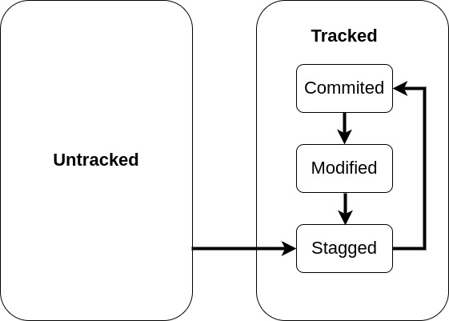
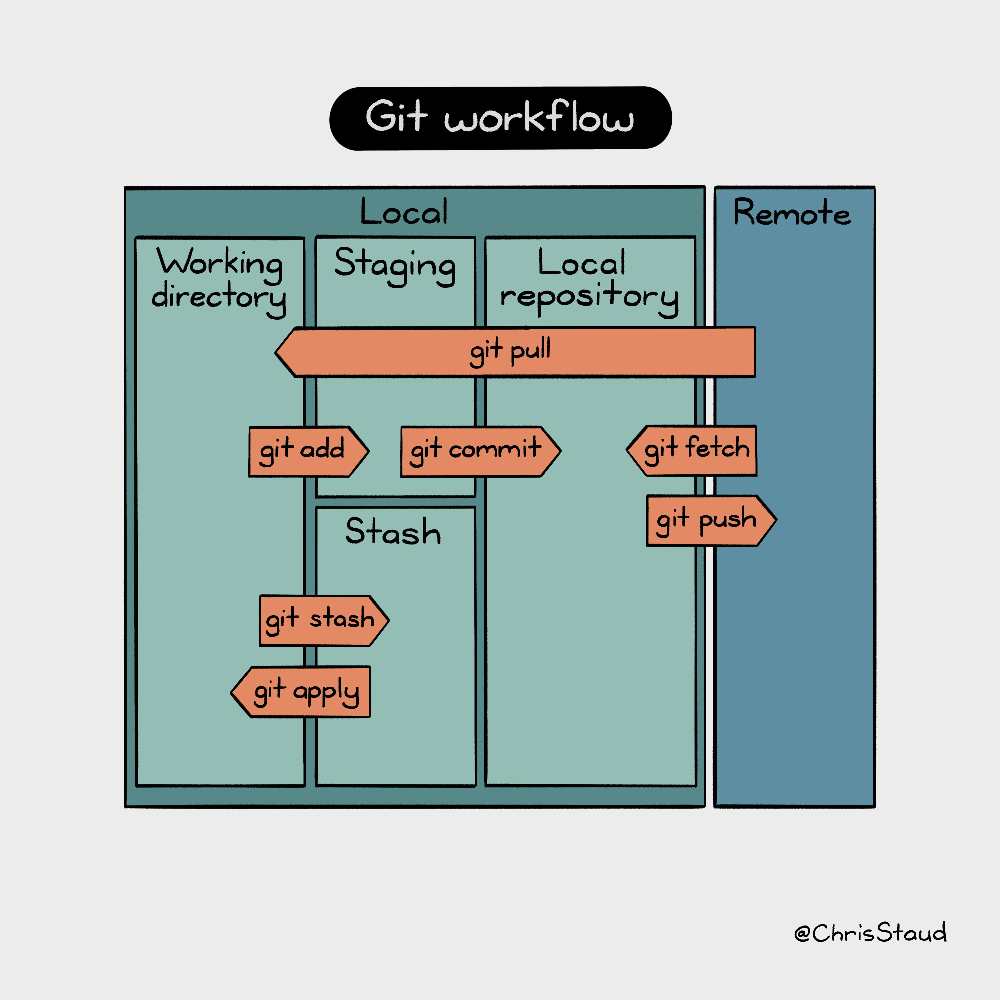

# Git

### States of a file in a Git repo and the transition between them

### Git Workflow

### setting a name ando email address
```
git config --global user.name "Mike McQuaid"
git config --global user.email mike@mikemcquaid.com
```
### Initializing a Git repository
```
git init
 ```
### Adding a file to the Index or staging area
```
git add <file_name>
git status
```
### Committing changes staged in the index
```
git commit -m "a comment" 
```
### History output
```
git log
```
### Cloning a remote/GitHub repository onto your local machine
```
git clone <url_remote_repo>
```
### Pushing changes to a remote repository: git push
```
git push origin <branch_name>
```
### Pulling changes from another repository: git pull

git pull downloads the new commits from another repository and merges the remote branch into the current branch.

```
git pull
```
### Fetching changes from a remote without modifying local branches: git fetch

git pull performs two actions: fetching the changes from a remote repository and merging them into the current branch. Sometimes you may wish to download the new commits from the remote repository without merging them into your current branch (or without merging them yet). To do this, you can use the git fetch command. git fetch performs the fetching action of downloading the new commits but skips the merge step (which you can manually perform later)

```
git fetch
```

### Creating a new local branch from the current branch: 
```
git branch
```

* Create a new branch
```
git branch <branch_name>
```
* Listing branches
```
git branch
```
* Setting branch to be current branch
```
git checkout <branch_name>
```
(Make sure you’ve committed any changes on the current branch before checking out a new branch. If you don’t do this, git checkout will refuse to check out the new branch if there are changes in that branch to a file with uncommitted changes. If you wish to overwrite these uncommitted changes anyway, you can force this with git checkout --force. Another solution is git stash, which allows temporary storage of changes)

### Pushing a local branch remotely
```
git push origin <new_local_branch_name>
```
### Merging an existing branch into the current branch: 

At some point, you have a branch you’re done with, and you want to bring all the commits made on it into another branch. This process is known as a merge
```
git merge <different_branch>
```